# fopix
Simple monospaced pixel font package for golang

Partly idea taken from: [pixfont](https://github.com/pbnjay/pixfont)

## Installation
```bash
go get github.com/toelsiba/fopix
```

## Fonts

Font files are available in the directory [fonts](fonts). Fonts is saved in JSON format.

#### Digits 3x3
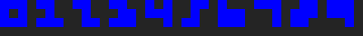

#### Digits 3x4


#### Digits 3x5
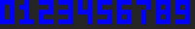

#### [3x3 Font for Nerds](http://cargocollective.com/slowercase/3x3-Font-for-Nerds)
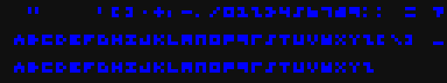

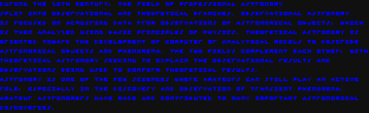

#### Victor
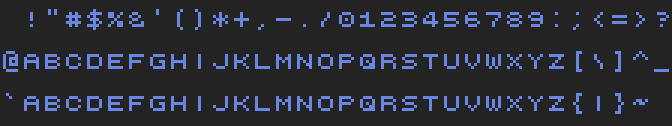

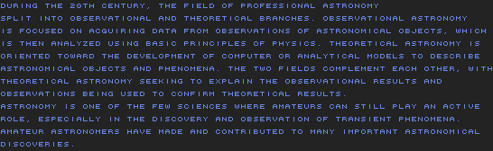

#### [Miniwi](https://github.com/sshbio/miniwi)
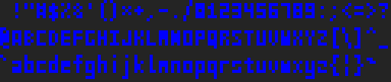

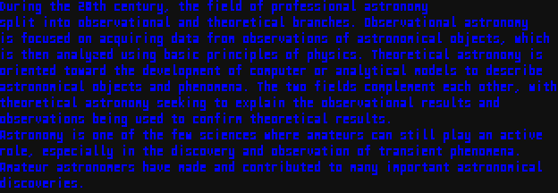

#### [Tom Thumb](http://robey.lag.net/2010/01/23/tiny-monospace-font.html#comment-1526952840)
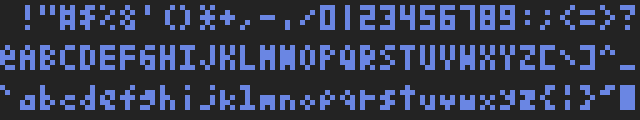

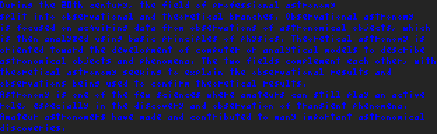

#### Tom Thumb New
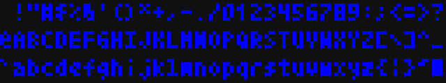

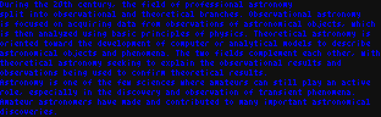

#### Pixefon
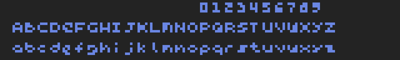

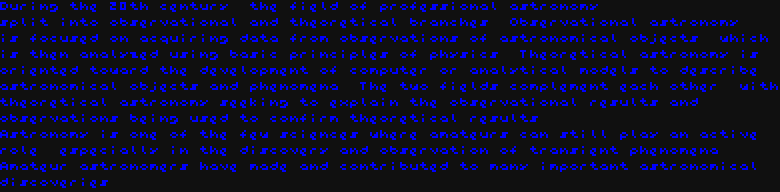

---

## Examples

### using existing font
```go
package main

import (
	"image"
	"log"

	"github.com/toelsiba/fopix"
	"github.com/toelsiba/fopix/imutil"
)

func main() {

	f, err := fopix.NewFromFile("../../fonts/tom-thumb-new.json")
	if err != nil {
		log.Fatal(err)
	}
	f.Scale(5)

	const text = "Hello, World!"

	m := image.NewRGBA(f.GetTextBounds(text))

	f.DrawText(m, image.ZP, text)

	if err = imutil.ImageSaveToPNG("hello-world.png", m); err != nil {
		log.Fatal(err)
	}
}
```
#### Result image


### using custom font
```go
package main

import (
	"image"
	"image/color"
	"log"

	"github.com/toelsiba/fopix"
	"github.com/toelsiba/fopix/imutil"
)

// custom font
var gopherFont = fopix.FontInfo{
	Name:        "Go font",
	Author:      "Gopher",
	Description: "something ...",
	Size:        fopix.Size{Dx: 6, Dy: 7},
	AnchorPos:   image.Point{0, 0},
	TargetChar:  '0',
	CharSet: []fopix.RuneInfo{
		fopix.RuneInfo{
			Character: 'G',
			Bitmap: []string{
				"-000-",
				"0---0",
				"0----",
				"0-000",
				"0---0",
				"-000-",
			},
		},
		fopix.RuneInfo{
			Character: 'o',
			Bitmap: []string{
				"-----",
				"-----",
				"-000-",
				"0---0",
				"0---0",
				"-000-",
			},
		},
	},
}

func main() {

	f, err := fopix.New(gopherFont)
	if err != nil {
		log.Fatal(err)
	}
	f.Scale(10)
	f.Color(color.RGBA{0, 0, 0xFF, 0xFF})

	text := "Go"

	m := image.NewRGBA(f.GetTextBounds(text))

	imutil.ImageSolidFill(m, color.White)

	f.DrawText(m, image.ZP, text)

	if err = imutil.ImageSaveToPNG("go-font.png", m); err != nil {
		log.Fatal(err)
	}
}
```
#### Result image
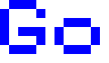
