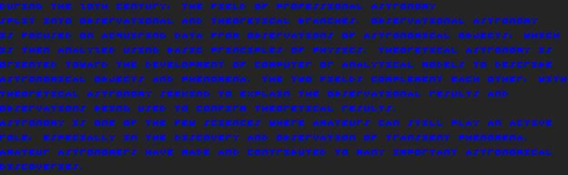
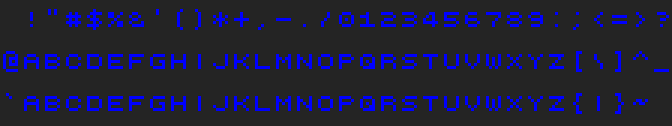
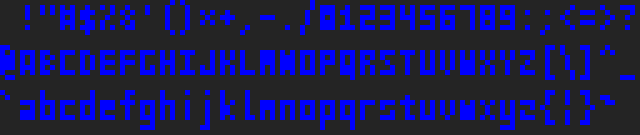
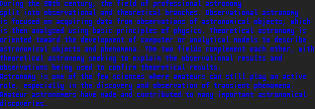
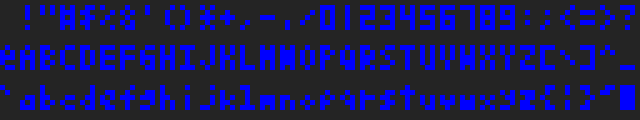
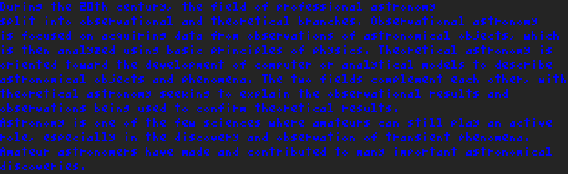

# fopix
Simple monospaced pixel font package for golang

Partly idea taken from: [pixfont](https://github.com/pbnjay/pixfont)

## Installation
```bash
go get github.com/toelsiba/fopix
```

## Fonts

Font files are available in the [fonts](fonts)

####digits 3x3


####Digits 3x4


####Digits 3x5


####[3x3 Font for Nerds](http://cargocollective.com/slowercase/3x3-Font-for-Nerds)


###Victor



####[Miniwi](https://github.com/sshbio/miniwi)




####[Tom Thumb](http://robey.lag.net/2010/01/23/tiny-monospace-font.html#comment-1526952840)




---

## Example

```go
package main

import (
	"bufio"
	"image"
	"image/png"
	"log"
	"os"

	"github.com/toelsiba/fopix"
)

func main() {

	f, err := fopix.NewFromFile("../fonts/tom-thumb-new.json")
	if err != nil {
		log.Fatal(err)
	}
	f.Scale(5)

	const text = "Hello, World!"

	m := image.NewRGBA(f.GetTextBounds(text))

	f.DrawText(m, image.ZP, text)

	if err = imageSaveToPNG("test.png", m); err != nil {
		log.Fatal(err)
	}
}

func imageSaveToPNG(fileName string, i image.Image) error {

	file, err := os.Create(fileName)
	if err != nil {
		return err
	}
	defer file.Close()

	w := bufio.NewWriter(file)
	defer w.Flush()

	return png.Encode(w, i)
}
```
